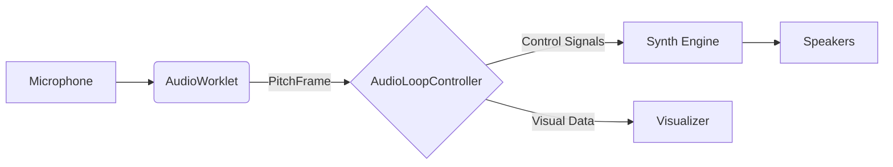

<div align="center">
  <h1>🎵 Mambo Whistle</h1>
  <p>
    <strong>Makes Any Mouth Become Orchestra</strong>
  </p>
  <p>
    Real-time neural vocal synthesis engine bridging Web Audio DSP with future embedded neural hardware.
  </p>

  <p>
    <a href="#features">Features</a> •
    <a href="#architecture">Architecture</a> •
    <a href="#getting-started">Getting Started</a> •
    <a href="#tech-stack">Tech Stack</a> •
    <a href="#contributing">Contributing</a>
  </p>

  <br>

  
</div>

<br>

## 🚀 Introduction

**Mambo Whistle** is a high-performance web application that leverages the Web Audio API to transform vocal input into synthesized instrument sounds in real-time. Unlike traditional pitch-to-MIDI converters, Mambo Whistle uses a custom DSP pipeline running on `AudioWorklet` to ensure low latency (~50-60ms), preserving the nuanced expression of the human voice including vibrato, slides, and dynamics.

### Why It's Different
Whether you want to sound like a saxophone, a violin, or a futuristic synthesizer, Mambo Whistle provides an immersive, "liquid" playing experience that feels like a real instrument.

## ✨ Key Features

-   **Low-Latency Core**: Built on `AudioWorklet` with a custom ring-buffer architecture to decouple audio processing from the main thread, achieving ~50-60ms end-to-end latency.
-   **Dual Engine Architecture**:
    -   **Continuous Mode**: Tracks precise frequency changes for smooth slides and vibrato (Portamento / Glissando).
    -   **Legacy Mode**: Quantizes pitch to the nearest semitone for a classic keyboard/sampler feel.
-   **Pro-Grade DSP**:
    -   **YIN Algorithm**: Optimized implementation for accurate, monophonic pitch detection down to 80Hz.
    -   **FastFFT**: Custom O(N log N) FFT implementation for spectral feature extraction (Brightness, Breathiness).
    -   **Liquid Visualizer**: 60fps hardware-accelerated canvas rendering for real-time pitch feedback.
-   **Smart Auto-Tune**: Integrated pitch correction with adjustable strength and speed, supporting multiple scales (Chromatic, Major, Minor, Pentatonic, Blues).
-   **Expressive Synthesis**: Maps vocal volume and timbre to synth parameters (Cutoff, Resonance, Envelope) for dynamic expression.
-   **Privacy First**: All processing happens locally in the browser. No audio data is ever sent to a server.

## Architecture

Mambo Whistle follows a modern, decoupled architecture designed for performance and maintainability.

### Core Components

1.  **AudioIO Layer**: A robust abstraction over the Web Audio API that handles browser compatibility, sample rate conversion, and graceful degradation (Worklet -> ScriptProcessor).
2.  **AudioWorklet (The Engine)**: Runs in a separate thread. Handles DSP tasks:
    -   Pitch Detection (YIN)
    -   Spectral Analysis (FFT)
    -   Onset/Transient Detection
3.  **AudioLoopController**: The central nervous system. It receives `PitchFrame` data from the Worklet and orchestrates the synthesis engine and visualizer, ensuring the UI never blocks audio.
4.  **State Management**: A centralized, Flux-like `StateStore` manages application state (settings, active devices, status), promoting a unidirectional data flow.
5.  **VisualizerManager**: A decoupled rendering engine that draws the "Liquid Ribbon" visualization using `requestAnimationFrame`.

### Data Flow



## 🛠 Tech Stack

-   **Frontend**: Vanilla JavaScript (ES Modules) for maximum performance and zero compile-time overhead.
-   **Styling**: Tailwind CSS for utility-first design, enhanced with custom CSS for Apple-style aesthetics (Glassmorphism).
-   **Audio**: Web Audio API, Tone.js (for synthesis graph management).
-   **Testing**: Vitest for unit and integration testing.
-   **Tooling**: Node.js, npm.

## 🏁 Getting Started

### Prerequisites

-   Node.js (v14 or higher)
-   npm (v6 or higher)
-   A modern web browser (Chrome/Edge recommended for best AudioWorklet performance)

### Installation

1.  **Clone the repository**
    ```bash
    git clone https://github.com/Team-Kazoo/mambo.git
    cd mambo
    ```

2.  **Install dependencies**
    ```bash
    npm install
    ```

3.  **Start the development server**
    ```bash
    npm start
    ```
    The application will be available at `http://localhost:3000`.

4.  **Run tests** (Optional)
    ```bash
    npm test
    ```

## 📖 Usage Guide

1.  **Select an Instrument**: Choose from a variety of presets like Flute, Saxophone, Violin, or Cello.
2.  **Start Engine**: Click the "Start Engine" button. Grant microphone permissions when prompted.
    *   *Tip: Use headphones to prevent feedback loops!*
3.  **Play**: Hum, sing, or whistle into your microphone. The visualizer will react instantly.
4.  **Adjust Settings**:
    *   **Auto-Tune**: Toggle pitch correction and select a scale/key.
    *   **Effects**: Add Reverb or Delay for atmosphere.
    *   **Mode**: Switch between "Continuous" (smooth) and "Legacy" (stepped) modes.

## 🛣 Roadmap

-   [x] **Phase 1: Core DSP & AudioWorklet** - Stable low-latency tracking.
-   [x] **Phase 2: UI/UX Modernization** - Glassmorphism design & Liquid Visualizer.
-   [ ] **Phase 3: Neural Audio Research** - Implement RAVE/DDSP for photorealistic synthesis.
-   [ ] **Phase 4: Embedded Hardware** - Prototype on NVIDIA Jetson & Raspberry Pi.
-   [ ] **Phase 5: Connectivity** - MIDI export & VST/AU Plugin wrapper.
-   [ ] **Phase 6: Polyphony** - Experimental polyphonic voice tracking.

## 🔮 Technical Upgrade & Research

We are actively researching the migration from Web Audio API to embedded hardware and next-generation Neural Audio Synthesis. Our goal is to create a standalone physical instrument.

**Key Research Areas:**
*   **Neural Synthesis:** Moving to **RAVE** (Realtime Audio Variational autoEncoder) and **DDSP** for photorealistic instrument emulation.
*   **Deep Learning Perception:** Exploring **CREPE**, **SPICE**, and 2025-era models (SwiftF0, FCPE) for robust pitch tracking in noisy environments.
*   **Hardware:** Targeting **NVIDIA Jetson** and **Raspberry Pi 5** for embedded deployment.

👉 **[Read the full Research & Hardware Roadmap](docs/research/FUTURE_TECHNOLOGIES.md)**

## 🤝 Contributing

We welcome contributions from the community! Whether it's a bug fix, a new feature, or a documentation improvement, your help is appreciated.

1.  Fork the Project
2.  Create your Feature Branch (`git checkout -b feat/AmazingFeature`)
3.  Commit your Changes (`git commit -m 'feat: Add some AmazingFeature'`)
4.  Push to the Branch (`git push origin feat/AmazingFeature`)
5.  Open a Pull Request

## 🚀 Join Our Mission

We are a startup team transitioning from a software MVP to a physical, embedded instrument. We are looking for passionate engineers and designers to help us build the future of expressive synthesis.

**We WANT YOU!:**

*   **Embedded Systems Engineer (Linux/RTOS)**: Lead the migration from Web Audio to embedded platforms. You will evaluate and prototype on architectures like **NVIDIA Jetson**, **Raspberry Pi 5**, and high-performance **ESP32** chips, optimizing low-latency audio drivers and C++ DSP pipelines.
*   **Industrial Designer**: Define the physical form factor, ergonomics, and aesthetic language of the standalone instrument.
*   **Neural Audio Researcher**: Optimize deep learning models (RAVE, DDSP) for real-time inference on edge devices.

If you are excited about music technology and hardware, contact us at **[zwangnv@connect.ust.hk](mailto:zwangnv@connect.ust.hk)**.

## 📄 License

Proprietary. Copyright (c) 2025 Ziming Wang. All Rights Reserved.
Unauthorized copying, modification, distribution, or use of this software is strictly prohibited.

**Authors**:
*   **Ziming Wang**
*   **Chuyue Gong**
*   **Tianxing Chang**