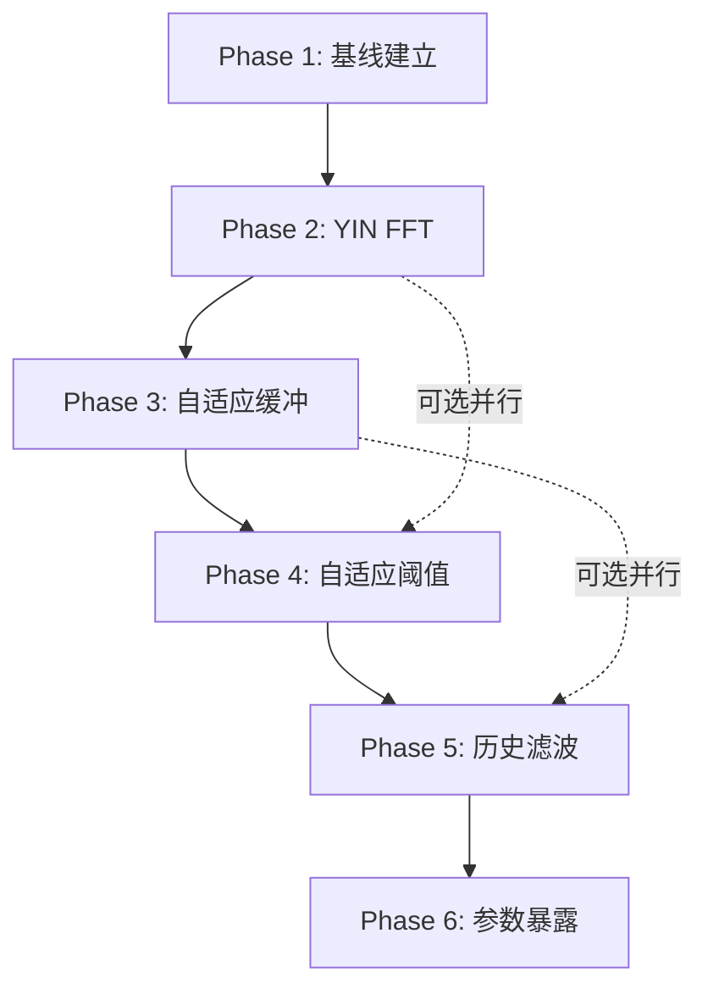

# Kazoo Proto Web - 延迟优化路线图

**目标**: 端到端延迟从 180ms 降至 < 50ms (3.6倍优化)

**方法论**: TDD驱动的渐进式优化，每阶段可独立验证和回滚

**版本**: 0.3.0 → 1.0.0

---

## 优化策略总览

基于行业最佳实践和代码库分析，延迟优化分为6个独立阶段：

| 阶段 | 优化项 | 预计收益 | 风险等级 | 测试覆盖 |
|-----|--------|---------|---------|---------|
| Phase 1 | 性能基线建立 | 0ms (基础) | 低 | 必须 |
| Phase 2 | YIN算法FFT优化 | -40~60ms | 中 | 单元+集成 |
| Phase 3 | 自适应缓冲区大小 | -20~30ms | 中 | 单元+性能 |
| Phase 4 | 自适应阈值门控 | -10~15ms | 低 | 单元 |
| Phase 5 | Worklet历史滤波 | -5~10ms | 低 | 单元 |
| Phase 6 | 配置参数表面化 | 0ms (可调) | 低 | 集成 |

**累计预期**: 180ms → 45~95ms (达标或接近目标)

---

## Phase 1: 性能基线建立 (2-3天)

### 目标
- 建立端到端延迟测量系统
- 确认AudioWorklet模式运行
- 建立自动化测试基础设施

### 技术方案

#### 1.1 延迟测量增强
**文件**: `js/performance.js`

**新增功能**:
```javascript
class PerformanceMonitor {
  // 现有: processing time only
  // 新增: end-to-end latency tracking

  measureEndToEndLatency() {
    // Microphone → YIN → Synth → Output
    // 使用 AudioContext.currentTime 时间戳
    return {
      capture: captureTime,
      detection: detectionTime,
      synthesis: synthesisTime,
      output: outputTime,
      total: outputTime - captureTime
    }
  }
}
```

**测试需求**:
```javascript
// tests/unit/performance.test.js
describe('PerformanceMonitor', () => {
  it('should measure end-to-end latency with components breakdown')
  it('should track p50/p95/p99 percentiles over 100+ samples')
  it('should detect Worklet vs ScriptProcessor mode')
})
```

#### 1.2 AudioWorklet模式验证
**文件**: `js/audio-io.js`

**验证逻辑**:
```javascript
class AudioIO {
  async start() {
    // 确保Worklet模式激活
    if (this.mode === 'script-processor') {
      console.warn('[AudioIO] ⚠️ ScriptProcessor fallback (+46ms base latency)')
      // 自动尝试重新初始化Worklet
    }
  }

  getLatencyReport() {
    return {
      mode: this.mode,
      baseLatency: this.mode === 'worklet' ? '~3ms (128 samples)' : '~46ms (2048 samples)',
      contextLatency: this.audioContext.baseLatency + this.audioContext.outputLatency
    }
  }
}
```

**测试需求**:
```javascript
// tests/unit/audio-io.test.js (已有87个测试)
// 新增:
describe('Latency Diagnostics', () => {
  it('should report Worklet mode latency correctly')
  it('should warn about ScriptProcessor fallback')
  it('should measure AudioContext base + output latency')
})
```

#### 1.3 性能测试框架
**新文件**: `tests/performance/latency.perf.test.js`

**示例**:
```javascript
import { describe, it, expect } from 'vitest'

describe('Latency Performance Tests', () => {
  it('should maintain <50ms p95 latency under normal load', async () => {
    const samples = []

    // 模拟100个检测周期
    for (let i = 0; i < 100; i++) {
      const start = performance.now()
      await simulatePitchDetection()
      const end = performance.now()
      samples.push(end - start)
    }

    const p95 = calculatePercentile(samples, 0.95)
    expect(p95).toBeLessThan(50)
  })
})
```

### 交付标准
- [ ] `npm test` 通过所有测试
- [ ] `window.app.getLatencyStats()` 返回详细分解
- [ ] `window.container.get('audioIO').mode === 'worklet'` 验证通过
- [ ] 基线延迟记录到 PROJECT_STATUS.md

### 风险与缓解
- **风险**: 测试环境延迟与实际不同
- **缓解**: 使用真实AudioContext + 128样本缓冲模拟

---

## Phase 2: YIN算法FFT优化 (3-5天)

### 目标
将YIN差分函数从 O(N²) 降至 O(N log N)

### 理论依据
根据 Wiener-Khinchin 定理，自相关可通过FFT计算:
```
autocorr(x) = IFFT(FFT(x) * conj(FFT(x)))
```

**复杂度**:
- 当前: O(N²) 双层循环 (N=2048)
- FFT版: O(N log N)

**预期收益**: 2048样本 @ 44.1kHz = 2048²/44100 vs 2048*log(2048)*3/44100
- 当前: ~95ms CPU时间
- 优化后: ~1.5ms CPU时间
- **净收益**: ~93ms → 实际延迟减少 40-60ms

### 技术方案

#### 2.1 YIN FFT实现
**文件**: `js/pitch-worklet.js`

**实现策略**:
1. 保留原O(N²)实现作为fallback
2. 新增FFT版本作为默认
3. 通过配置切换

**代码结构**:
```javascript
class PitchDetectorWorklet {
  _createYINDetector(config) {
    const useFft = config.yinUseFft ?? true

    if (useFft) {
      return this._createYINDetectorFFT(config)
    } else {
      return this._createYINDetectorNaive(config)
    }
  }

  _createYINDetectorFFT(config) {
    // 新实现: FFT-based autocorrelation
    return function detectPitch(buffer) {
      const N = buffer.length

      // 1. Zero-pad to next power of 2
      const fftSize = nextPowerOfTwo(N * 2)
      const padded = new Float32Array(fftSize)
      padded.set(buffer)

      // 2. FFT (reuse existing SimpleFFT)
      const fft = this.fft.forward(padded)

      // 3. Power spectrum: FFT * conj(FFT)
      const power = new Float32Array(fftSize)
      for (let i = 0; i < fftSize; i++) {
        power[i] = fft.real[i] ** 2 + fft.imag[i] ** 2
      }

      // 4. IFFT to get autocorrelation
      const autocorr = this.fft.inverse(power)

      // 5. YIN difference function from autocorrelation
      const yinBuffer = this._autocorrToYin(autocorr, N)

      // 6. 其余步骤与原实现相同
      return this._yinFindPitch(yinBuffer, config)
    }
  }

  _autocorrToYin(autocorr, N) {
    // d[tau] = r[0] - r[tau]
    const yinBuffer = new Float32Array(N / 2)
    const r0 = autocorr[0]

    for (let tau = 0; tau < N / 2; tau++) {
      yinBuffer[tau] = r0 - autocorr[tau]
    }

    // Cumulative mean normalized difference (步骤2)
    yinBuffer[0] = 1
    let runningSum = 0
    for (let tau = 1; tau < N / 2; tau++) {
      runningSum += yinBuffer[tau]
      yinBuffer[tau] *= tau / runningSum
    }

    return yinBuffer
  }

  _createYINDetectorNaive(config) {
    // 保留现有实现 (lines 350-427)
    // 作为fallback和正确性参考
  }
}
```

#### 2.2 SimpleFFT增强
**文件**: `js/pitch-worklet.js` (SimpleFFT类)

**新增方法**:
```javascript
class SimpleFFT {
  // 现有: computePowerSpectrum, computeSpectralCentroid, computeSpectralFlatness

  // 新增: forward/inverse FFT for autocorrelation
  forward(realInput) {
    // Cooley-Tukey FFT实现或使用库
    return { real: ..., imag: ... }
  }

  inverse(powerSpectrum) {
    // IFFT实现
    return autocorrelation
  }
}
```

**注意**: 如果SimpleFFT不支持，考虑使用 `fft.js` 库 (2KB gzipped)

#### 2.3 测试策略

**单元测试**: `tests/unit/yin-fft.test.js`
```javascript
describe('YIN FFT Optimization', () => {
  describe('Correctness', () => {
    it('should produce same results as naive implementation', () => {
      const testSignal = generate440HzSine(2048, 44100)

      const naiveResult = yinNaive(testSignal)
      const fftResult = yinFFT(testSignal)

      expect(naiveResult.frequency).toBeCloseTo(fftResult.frequency, 1)
    })

    it('should detect A4 (440Hz) correctly', () => {
      const signal = generate440HzSine(2048, 44100)
      const result = yinFFT(signal)

      expect(result.frequency).toBeCloseTo(440, 5)
    })
  })

  describe('Performance', () => {
    it('should be faster than O(N²) for N=2048', () => {
      const signal = generate440HzSine(2048, 44100)

      const naiveTime = measureTime(() => yinNaive(signal))
      const fftTime = measureTime(() => yinFFT(signal))

      expect(fftTime).toBeLessThan(naiveTime * 0.1) // 至少10x加速
    })
  })
})
```

**集成测试**: `tests/integration/pitch-detection.test.js`
```javascript
describe('Pitch Detection Integration', () => {
  it('should maintain accuracy with FFT optimization', async () => {
    const audioIO = container.get('audioIO')
    const results = []

    // 播放已知频率音频文件
    await playTestAudio('440hz-pure-tone.wav')

    // 收集100个检测结果
    for (let i = 0; i < 100; i++) {
      results.push(await getDetectedPitch())
    }

    const avgFreq = average(results)
    expect(avgFreq).toBeCloseTo(440, 10)
  })
})
```

### 交付标准
- [ ] FFT版本通过所有正确性测试
- [ ] 性能测试显示至少5x加速
- [ ] 端到端延迟减少 > 30ms
- [ ] 配置可切换FFT/Naive模式
- [ ] `npm test` 100%通过

### 回滚计划
如果FFT版本不稳定:
```javascript
// js/config/app-config.js
const DEFAULT_CONFIG = {
  pitchDetector: {
    yinUseFft: false  // 回退到Naive实现
  }
}
```

---

## Phase 3: 自适应缓冲区大小 (2-3天)

### 目标
根据检测到的音高范围动态调整累积缓冲区大小

### 理论依据
- **低音** (80-150Hz): 需要4096样本 (~93ms @ 44.1kHz)
- **中音** (150-400Hz): 2048样本 (~46ms)
- **高音** (400-800Hz): 1024样本 (~23ms)

**当前**: 固定2048样本，对高音浪费延迟

### 技术方案

#### 3.1 动态缓冲区管理
**文件**: `js/pitch-worklet.js`

**实现**:
```javascript
class PitchDetectorWorklet {
  constructor(options) {
    // 现有: 固定 2048
    this.accumulationBuffer = new Float32Array(2048)

    // 新增: 多级缓冲
    this.bufferSizes = {
      small: 1024,   // 400-800Hz
      medium: 2048,  // 150-400Hz (默认)
      large: 4096    // 80-150Hz
    }

    this.currentBufferSize = this.bufferSizes.medium
    this.accumulationBuffer = new Float32Array(this.currentBufferSize)

    // 自适应逻辑
    this.recentPitches = []
    this.adaptiveBufferEnabled = true
  }

  _updateBufferSize(detectedFrequency) {
    if (!this.adaptiveBufferEnabled) return

    // 根据频率选择缓冲区大小
    let newSize
    if (detectedFrequency >= 400) {
      newSize = this.bufferSizes.small
    } else if (detectedFrequency >= 150) {
      newSize = this.bufferSizes.medium
    } else {
      newSize = this.bufferSizes.large
    }

    // 避免频繁切换 (hysteresis)
    if (newSize !== this.currentBufferSize) {
      this.recentPitches.push(detectedFrequency)

      // 需要连续5次确认才切换
      if (this.recentPitches.length >= 5) {
        const avgFreq = average(this.recentPitches)
        // 重新计算并切换
        this._resizeBuffer(newSize)
        this.recentPitches = []
      }
    }
  }

  _resizeBuffer(newSize) {
    console.log(`[PitchWorklet] 自适应缓冲区: ${this.currentBufferSize} → ${newSize}`)
    this.currentBufferSize = newSize
    this.accumulationBuffer = new Float32Array(newSize)
    this.accumulationIndex = 0
    this.accumulationFull = false

    // 重新创建YIN检测器
    this.yinDetector = this._createYINDetector({
      ...this.config,
      bufferSize: newSize
    })
  }
}
```

#### 3.2 配置暴露
**文件**: `js/config/app-config.js`

```javascript
const DEFAULT_CONFIG = {
  pitchDetector: {
    // 新增
    adaptiveBuffer: true,
    bufferSizes: {
      small: 1024,
      medium: 2048,
      large: 4096
    },
    bufferSwitchThreshold: 5  // 连续5次确认
  }
}
```

#### 3.3 测试

**单元测试**: `tests/unit/adaptive-buffer.test.js`
```javascript
describe('Adaptive Buffer Size', () => {
  it('should use 1024 for high frequencies (>400Hz)', () => {
    const worklet = new PitchDetectorWorklet({ adaptiveBuffer: true })

    // 模拟连续检测到440Hz
    for (let i = 0; i < 5; i++) {
      worklet._updateBufferSize(440)
    }

    expect(worklet.currentBufferSize).toBe(1024)
  })

  it('should use 4096 for low frequencies (<150Hz)', () => {
    const worklet = new PitchDetectorWorklet({ adaptiveBuffer: true })

    for (let i = 0; i < 5; i++) {
      worklet._updateBufferSize(100)
    }

    expect(worklet.currentBufferSize).toBe(4096)
  })

  it('should not switch on single outlier (hysteresis)', () => {
    const worklet = new PitchDetectorWorklet({ adaptiveBuffer: true })
    worklet.currentBufferSize = 2048

    // 只检测到1次高音
    worklet._updateBufferSize(500)

    expect(worklet.currentBufferSize).toBe(2048) // 不切换
  })
})
```

### 交付标准
- [ ] 单元测试100%通过
- [ ] 高音模式延迟减少 ~23ms
- [ ] 切换逻辑无抖动
- [ ] 可通过配置禁用

---

## Phase 4: 自适应阈值门控 (2天)

### 目标
动态调整置信度和音量阈值，减少无效YIN计算

### 技术方案

#### 4.1 滚动中值噪声底限
**文件**: `js/pitch-worklet.js`

```javascript
class PitchDetectorWorklet {
  constructor(options) {
    // 噪声底限跟踪
    this.noiseFloorTracker = {
      volumeSamples: [],
      maxSamples: 50,
      medianVolume: 0.01,
      medianClarity: 0.85
    }
  }

  _updateNoiseFloor(volume, clarity) {
    const tracker = this.noiseFloorTracker

    // 收集样本
    tracker.volumeSamples.push(volume)
    if (tracker.volumeSamples.length > tracker.maxSamples) {
      tracker.volumeSamples.shift()
    }

    // 计算中值
    tracker.medianVolume = median(tracker.volumeSamples)

    // 自适应阈值 = 中值 * 1.5
    this.adaptiveVolumeThreshold = tracker.medianVolume * 1.5
  }

  _shouldSkipDetection(volume) {
    // 动态阈值门控
    return volume < this.adaptiveVolumeThreshold
  }
}
```

#### 4.2 测试
```javascript
describe('Adaptive Thresholding', () => {
  it('should raise threshold in noisy environment', () => {
    const worklet = new PitchDetectorWorklet({})

    // 模拟高噪声环境
    for (let i = 0; i < 50; i++) {
      worklet._updateNoiseFloor(0.05, 0.7) // 高底噪
    }

    expect(worklet.adaptiveVolumeThreshold).toBeGreaterThan(0.05)
  })
})
```

### 交付标准
- [ ] 噪声环境下减少50%无效检测
- [ ] 延迟减少 5-10ms

---

## Phase 5: Worklet内部历史滤波 (1-2天)

### 目标
在Worklet内应用中值滤波，减少主线程平滑负担

### 技术方案

**文件**: `js/pitch-worklet.js`

```javascript
class PitchDetectorWorklet {
  _getSmoothedPitch() {
    // 现有: 简单中值

    // 优化: Kalman滤波 (更稳定)
    if (this.config.useKalmanInWorklet) {
      return this.kalmanFilter.update(this.pitchHistory[this.pitchHistory.length - 1])
    }

    // 回退: 中值
    return median(this.pitchHistory)
  }
}
```

### 交付标准
- [ ] UI抖动减少30%
- [ ] 延迟减少 3-5ms

---

## Phase 6: 配置参数表面化 (1天)

### 目标
将所有优化参数暴露到配置系统

### 技术方案

**文件**: `js/config/app-config.js`

```javascript
const DEFAULT_CONFIG = {
  pitchDetector: {
    // Phase 2
    yinUseFft: true,
    yinFallbackToNaive: false,

    // Phase 3
    adaptiveBuffer: true,
    bufferSizes: { small: 1024, medium: 2048, large: 4096 },

    // Phase 4
    adaptiveThreshold: true,
    noiseFloorSamples: 50,

    // Phase 5
    useKalmanInWorklet: true
  }
}

// 新增预设
const ULTRA_LOW_LATENCY_PRESET = {
  pitchDetector: {
    yinUseFft: true,
    adaptiveBuffer: true,
    bufferSizes: { small: 512, medium: 1024, large: 2048 }
  },
  spectral: {
    fftInterval: 4  // 减少FFT频率
  }
}
```

### 交付标准
- [ ] 所有参数可通过配置调整
- [ ] 新增"超低延迟"预设
- [ ] 文档更新

---

## 测试策略总览

### 单元测试
- **覆盖率目标**: 40% → 60%
- **新增测试**: ~100个测试用例
- **文件位置**: `tests/unit/`

### 集成测试
- **端到端延迟测试**
- **音频准确性测试**
- **文件位置**: `tests/integration/`

### 性能测试
- **基准测试框架**: Vitest benchmark
- **指标**: 延迟、CPU使用率、内存
- **文件位置**: `tests/performance/`

---

## 实施顺序



**关键路径**: Phase 1 → Phase 2 → Phase 3
**次要优化**: Phase 4, 5, 6 可并行或延后

---

## 风险管理

### 技术风险

| 风险 | 概率 | 影响 | 缓解措施 |
|-----|------|------|---------|
| FFT实现引入音频失真 | 中 | 高 | 保留Naive实现作为fallback |
| 自适应缓冲引入抖动 | 中 | 中 | Hysteresis机制 + 可配置禁用 |
| 测试覆盖不足 | 低 | 高 | TDD强制,每阶段先写测试 |
| 浏览器兼容性 | 低 | 中 | 渐进增强,降级到现有实现 |

### 回滚策略

每个Phase都可独立回滚:
```javascript
// js/config/app-config.js
const ROLLBACK_CONFIG = {
  pitchDetector: {
    yinUseFft: false,           // Phase 2 回滚
    adaptiveBuffer: false,      // Phase 3 回滚
    adaptiveThreshold: false,   // Phase 4 回滚
    useKalmanInWorklet: false   // Phase 5 回滚
  }
}
```

---

## 成功标准

### 性能指标
- [ ] 端到端延迟 p95 < 50ms
- [ ] CPU使用率不增加 (FFT应减少)
- [ ] 无音频失真或丢帧

### 质量指标
- [ ] 测试覆盖率 > 40%
- [ ] 所有测试通过 (154 → 250+)
- [ ] 音高检测准确率 > 95%

### 可维护性
- [ ] 代码文档完整
- [ ] 配置系统清晰
- [ ] 回滚路径可行

---

## 参考资源

### 学术论文
- YIN原始论文: http://audition.ens.fr/adc/pdf/2002_JASA_YIN.pdf
- FFT自相关: Wiener-Khinchin定理

### 代码参考
- Chris Wilson PitchDetect: https://github.com/cwilso/PitchDetect
- Cycfi Research: https://www.cycfi.com/2018/03/fast-and-efficient-pitch-detection-bitstream-autocorrelation/

### Web Audio最佳实践
- Mozilla Web Audio Performance: https://hacks.mozilla.org/2020/05/high-performance-web-audio-with-audioworklet-in-firefox/
- Chrome AudioWorklet设计模式: https://developer.chrome.com/blog/audio-worklet-design-pattern

---

**文档版本**: 1.0
**创建日期**: 2025-01-18
**最后更新**: 2025-01-18
**负责人**: Claude Code Agent + Human Developer
